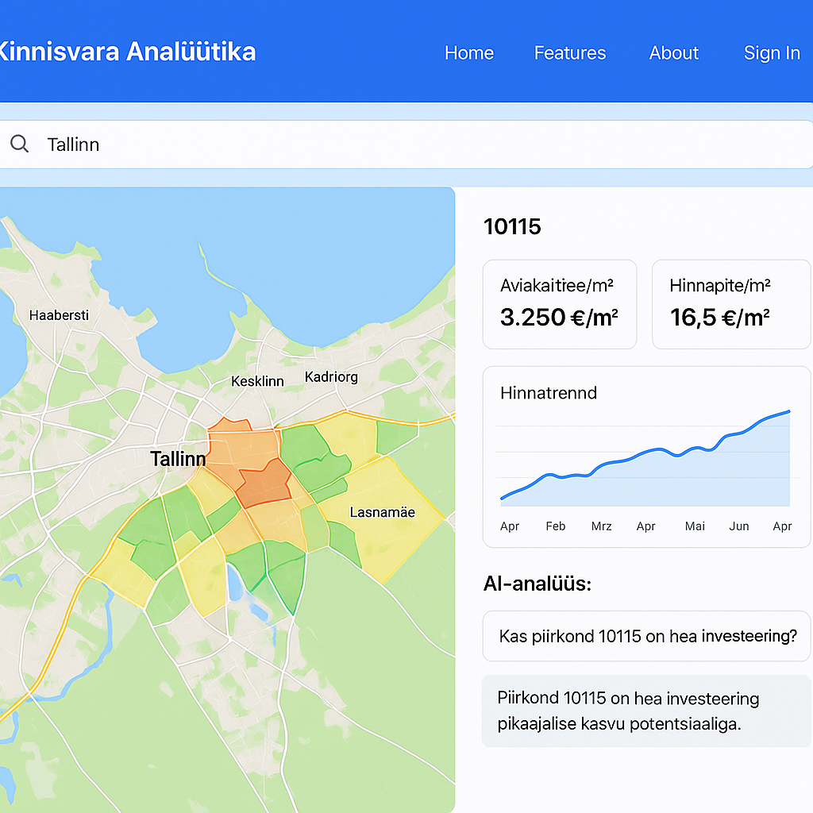

# 🏠 Kinnisvara AI MVP – Real Estate Analytics Platform for Estonia 🇪🇪

An AI-powered real estate analytics platform focused on the Estonian property market.  
Designed for real estate professionals, investors, and developers looking for data-driven insight.


---

### ✅ Features

- 🔍 **Address & postcode search** with autocomplete
- 🗺️ **Interactive map** with regional overlays (Leaflet.js)
- 📈 **Average sale & rental price trends**
- 🤖 **AI chat assistant** (GPT-4 integration)
- 🔮 **Price forecasting** (coming soon)
- 📤 **Export to PDF or CSV** (coming soon)

---

### 🛠️ Tech Stack

| Layer        | Tech                            |
|-------------|----------------------------------|
| Frontend     | React + Vite + TailwindCSS       |
| Backend      | FastAPI (Python 3.11)            |
| Database     | PostgreSQL + PostGIS             |
| AI API       | OpenAI GPT-4                     |
| Maps & Geo   | Leaflet.js + GeoJSON             |
| Hosting      | Railway / Supabase (suggested)   |

---

### 🌐 UI Preview



---

### 🚀 Getting Started

Clone this repository:

```bash
git clone https://github.com/janr86/real-estate-ai.git
cd real-estate-ai
